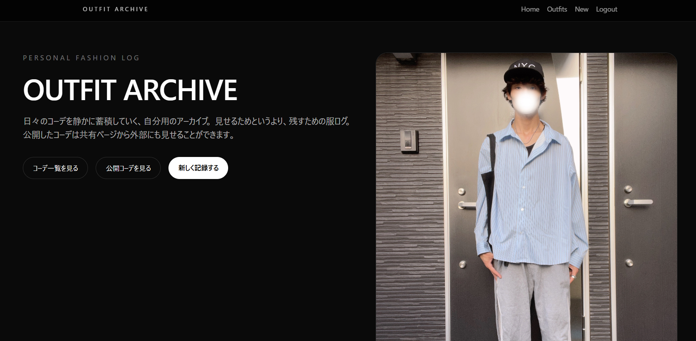
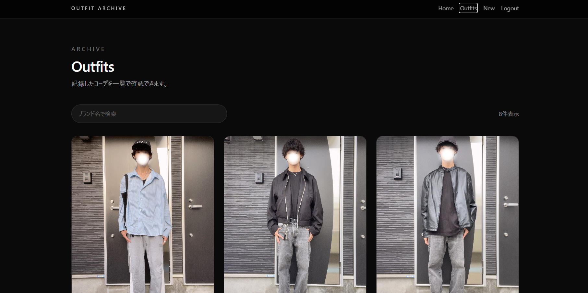
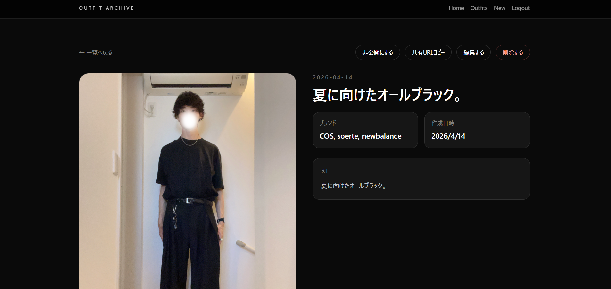
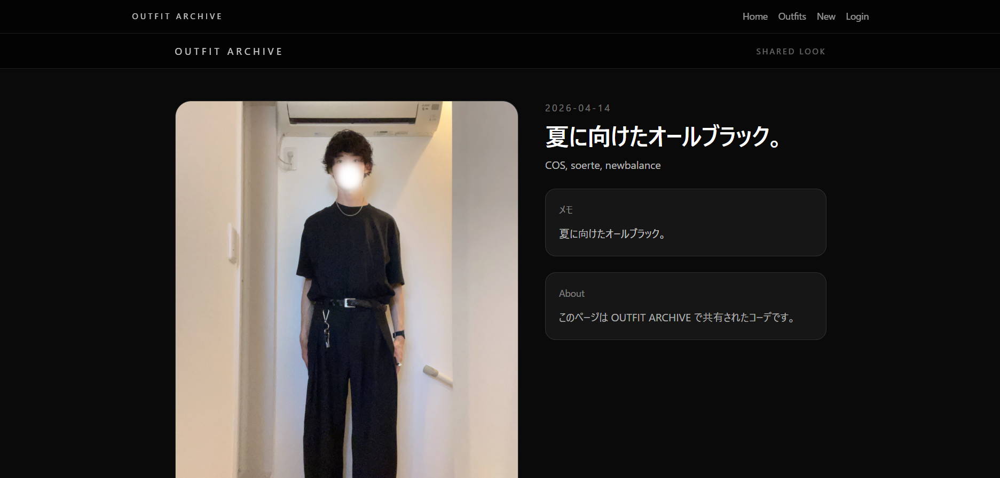

# OUTFIT ARCHIVE

自分専用のファッションコーデ記録アプリです。  
日々のコーデを画像付きで保存し、一覧・詳細で振り返ることができます。  
公開 / 非公開の切り替えや、共有URLによる公開ページ表示にも対応しています。

---

## Demo

- 本番環境（Vercel）  
  https://outfit-archive.vercel.app

---

## Screenshots

### Home



### Outfits



### Detail



### Share Page



---

## Features

- ユーザー登録 / ログイン（Supabase Auth）
- コーデ新規登録
- 画像アップロード（Supabase Storage）
- コーデ一覧表示
- コーデ詳細表示
- コーデ編集
- コーデ削除
- 公開 / 非公開切り替え
- 共有URL発行
- スマホブラウザ対応（レスポンシブ）

---

## Tech Stack

### Frontend

- Next.js (App Router)
- TypeScript
- Tailwind CSS

### Backend / BaaS

- Supabase
  - Authentication
  - PostgreSQL Database
  - Storage

### Infra

- Vercel

### Development

- Docker
- Git / GitLab

---

## Setup

### 起動方法（Dockerなし）

```bash
npm install
npm run dev
```

- アプリ起動後: http://localhost:3000

### 起動方法（Dockerあり）

```bash
docker compose up --build
```

---

## Environment Variables

.env.example を参考に .env.local を作成してください。

NEXT_PUBLIC_SUPABASE_URL=your_supabase_url
NEXT_PUBLIC_SUPABASE_ANON_KEY=your_supabase_anon_key
NEXT_PUBLIC_SITE_URL=http://localhost:3000

---

## Public Share Function

公開設定されたコーデは共有URLで閲覧できます。

例: /share/{share_id}

非公開コーデは共有URLからアクセスできません。

---

## Background

WEARのような「ファッションログ体験」を、
自分専用にシンプル化して再構築した個人開発アプリです。

・日々の服装記録
・スタイリングの振り返り
・季節ごとの傾向確認
・お気に入りコーデの共有

を目的として開発しました。

---

## Future Improvements

・OGP対応（SNSシェア強化）
・公開コーデ一覧ページ
・ブランド検索
・タグ機能
・並び替え機能
・UIブラッシュアップ

---

## Author

Tomoya Abe
