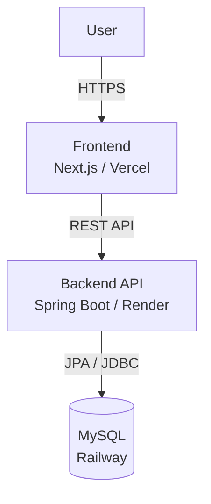

# Outfit Archive v3

Outfit Archive v3 is a full-stack portfolio application for recording and managing daily outfits.

This project was developed as a practical SE portfolio, focusing not only on UI implementation but also on layered architecture, API integration, database connection, deployment, and maintainability.

## Live Demo

- Frontend: Vercel
- Backend API: https://outfit-archive-backend.onrender.com
- Database: Railway MySQL

## Tech Stack

### Frontend
- Next.js App Router
- TypeScript
- Tailwind CSS
- Vercel

### Backend
- Java
- Spring Boot
- Spring Data JPA
- MySQL Connector/J
- Render

### Database
- MySQL
- Railway

## Features

- Outfit list
- Outfit detail
- Create outfit
- Edit outfit
- Delete outfit
- Search and filtering
- Responsive UI
- API-based data access
- MySQL persistence

## Architecture



## Project Structure

```text
app/                  # Next.js routes
components/           # UI components
features/outfits/     # outfit feature logic
lib/                  # shared services and API client
types/                # TypeScript types
backend/              # Spring Boot backend
```

## Development Highlights

* Designed the frontend with feature-based directory structure
* Introduced repository/service layers to make data access replaceable
* Started with localStorage/mock data, then migrated toward API-based architecture
* Built a Spring Boot backend with JPA
* Connected the backend to a MySQL database
* Deployed frontend, backend, and database separately
* Resolved production deployment issues around environment variables, JDBC URL, external DB access, and port binding

## Local Development

### Frontend

```bash
npm install
npm run dev
```

### Backend

```bash
cd backend
./mvnw spring-boot:run
```

### Docker

```bash
docker compose up --build
```

## Environment Variables

### Frontend

```env
NEXT_PUBLIC_API_URL=http://localhost:8080
```

### Backend

```env
SPRING_DATASOURCE_URL=jdbc:mysql://localhost:3306/outfit_archive
SPRING_DATASOURCE_USERNAME=outfit
SPRING_DATASOURCE_PASSWORD=outfit
```

For production, the backend uses Render environment variables and connects to Railway MySQL.

## API

Example endpoint:

```text
GET /api/outfits
```

## Purpose

This project was created to demonstrate practical full-stack development skills as a junior software engineer, including frontend implementation, backend API design, database integration, deployment, and troubleshooting.

## Future Improvements

* Authentication
* User-based authorization
* Image upload
* Public/private outfit sharing
* Test coverage
* CI/CD improvements


